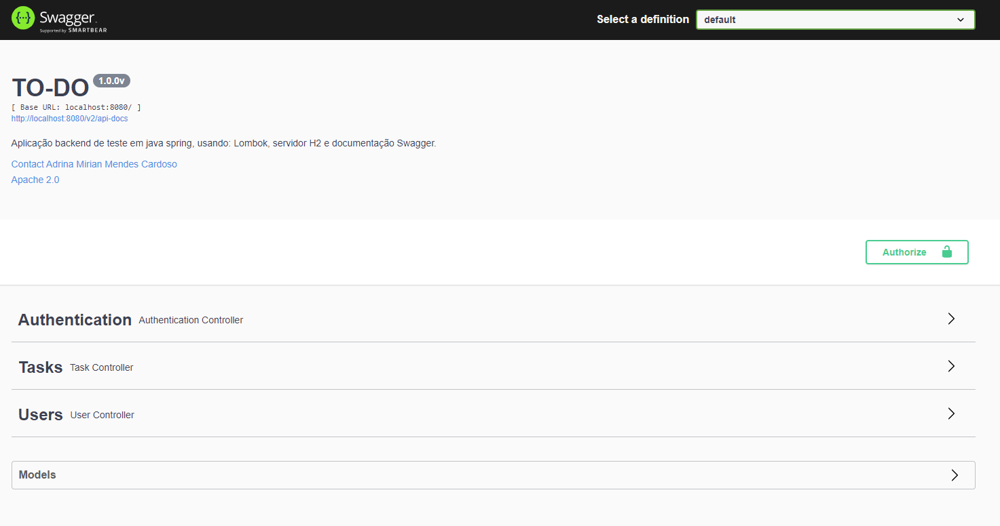
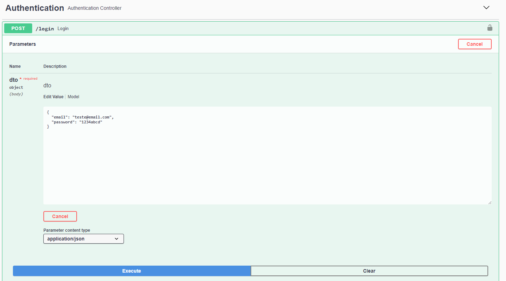
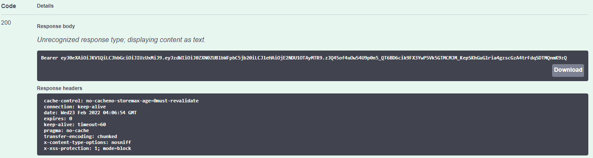

# TO-DO

Este projeto é uma aplicação backend desenvolvida em Java com Spring Boot, que oferece uma API RESTful para gerenciamento de tarefas. Foram utilizadas tecnologias como Lombok, Swagger, JWT e H2 Database. A aplicação já acompanha registros de teste para facilitar a validação das funcionalidades.

## Getting Start

O projeto segue uma arquitetura em camadas, com código organizado por responsabilidade. Foram utilizadas ferramentas como Lombok para reduzir a verbosidade, Swagger para documentação da API e JWT para autenticação. O banco de dados H2 inclui dados de teste pré-carregados via data.sql.

### Deploy

1. Clone o repositório:
   ```bash
   git clone git clone https://github.com/AdrianaMendes/java-viceri-to-do.git
   ```

2. Navegue até o diretório do projeto e execute:
   ```bash
   ./mvnw spring-boot:run
   ```

3. Acesse o sistema em:
   ```
   http://localhost:8080/swagger-ui/index.html

### Swagger



Para testar o usuário já está disponível um usuário padrão no endpoint.





## Banco de dados

- O projeto utiliza o **H2 Database** em memória.
  ```
  http://localhost:8080/h2-console
  ```
  - JDBC URL: `jdbc:h2:mem:viceri`
  - Usuário: `viceri`

## Licença

Este projeto está sob licença Apache 2.0 © 2022 Adriana Mirian Mendes Cardoso.
Para mais informações acesse o arquivo :scroll: `LICENSE.md`.

## Contato

**Adriana Cardoso**  
Desenvolvedora Java | Spring Boot | Angular  

- [LinkedIn](https://www.linkedin.com/in/amendescardoso/)  
- 📧 adrianamirianmc@gmail.com
