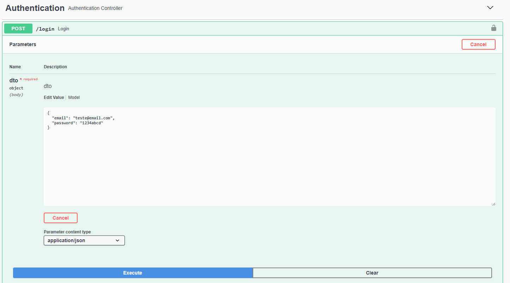

# TO-DO

Presente projeto é uma aplicação backend em java spring. Foi empregado no desenvolvimento Lombok, Swagger, JWT e servidor H2. A aplicação já acompanha registros de teste.

## Getting Start

O projeto foi organizado separando os códigos de acordo com o escopo e delegação de responsabilidade, por exemplo as classes responsáveis pelos controllers foram agrupadas, e a lógica se aplica aos demais. O Lombok foi utilizado para agilizar o desenvolvimento e reduzindo as quantidade de linhas necessárias para declarar por exemplo os getters e setters. O arquivo data.sql dentro da pasta resources realiza uma pré carga com objetivo de agilizar os testes. Os controllers foram descritos no swagger conforme os requisitos solicitado pelo documento. O token JWT foi empregado para gerenciar as sessões dos usuários. A implementação foi realizado de forma incremental consultando a documentação dos frameworks.

### Deploy

### Swagger

Para acessar a documentação swagger acesse esta URL: http://localhost:8080/swagger-ui/index.html

Para testar o usuário já está disponível um usuário padrão no endpoint.

### H2

Para acessar o banco de dados H2: http://localhost:8080/h2-console/

JDBC URL: **jdbc:h2:mem:viceri**

Nome do usuário: **viceri**

# Licença

Este projeto está sob licença Apache 2.0 © 2022 Adriana Mirian Mendes Cardoso.
Para mais informações acesse o arquivo :scroll: `LICENSE.md`.

# Contato

:email: E-Mail: ​[adrianamirianmc@gmail.com](adrianamirianmc@gmail.com)

:clipboard: Linkedin: ​[https://www.linkedin.com/in/adriana-mirian-mendes-cardoso](https://www.linkedin.com/in/adriana-mirian-mendes-cardoso)

:package: GitHub:  [https://github.com/AdrianaMendes](https://github.com/AdrianaMendes)